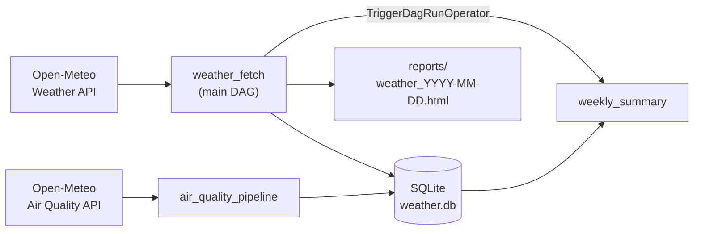
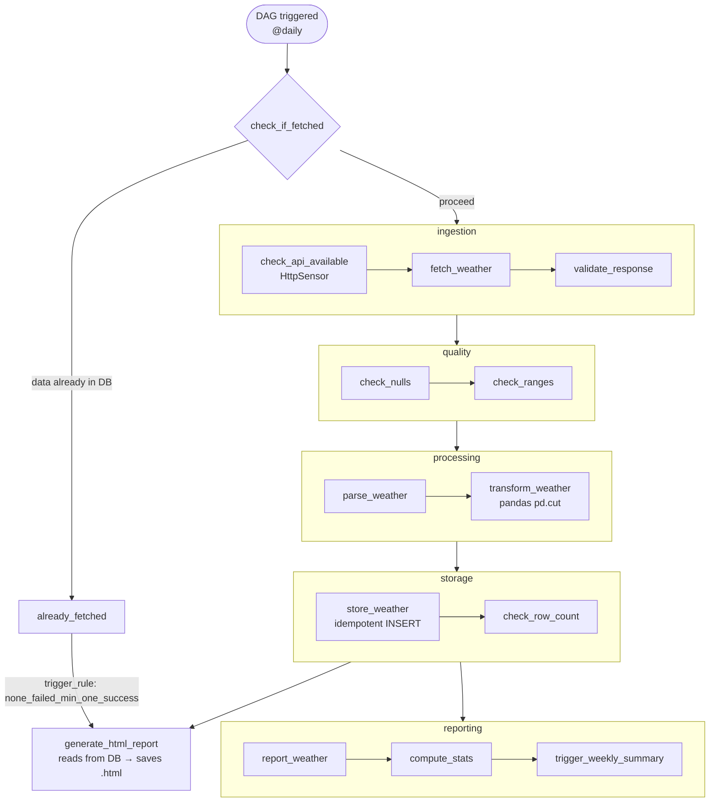

# WeatherFlow — Automated Weather Analytics Pipeline

> An Apache Airflow 3 project built over 14 daily increments — from a single "Hello World" DAG to a fully featured data pipeline with branching, sensors, task groups, data quality gates, and automated HTML reports.

Data is sourced from [Open-Meteo](https://open-meteo.com/) — free, no API key required.

---

## Architecture



---

## Pipeline: weather_fetch

The main DAG runs daily. Tasks are organised into collapsible `TaskGroup` blocks visible in the Airflow graph view.



---

## Quick start

```bash
# 1. Clone the repo
git clone https://github.com/KouhouMed/apache-airflow-learning.git
cd apache-airflow-learning

# 2. Copy env file
cp .env.example .env

# 3. First-time setup (build image + initialise DB + create admin user)
make init

# 4. Start all services
make up

# 5. Open the UI
#    http://localhost:8080  (admin / admin)
```

Or without `make`:

```bash
docker compose build
docker compose up airflow-init
docker compose up -d
```

### Stopping / cleaning up

```bash
make down        # stop containers, keep volumes
make clean       # stop + remove all volumes and generated files
```

---

## Viewing the HTML report

After a successful `weather_fetch` run, open the report directly in your browser:

```
reports/weather_YYYY-MM-DD.html
```

The file is bind-mounted from the Docker container, so it appears on your host machine immediately. No server needed — it is a fully self-contained HTML file.

---

## Airflow services (v3 architecture)

Airflow 3 splits what used to be a single `webserver` process into dedicated services:

| Container | Role |
|-----------|------|
| `airflow-api-server` | REST API + UI (port 8080) |
| `airflow-scheduler` | Triggers task instances on schedule |
| `airflow-dag-processor` | Parses DAG files (separated from scheduler in v3) |
| `airflow-triggerer` | Handles deferrable / async operators |
| `postgres` | Airflow metadata database |

---

## 14-day learning plan

| Day | DAG / Feature | Concept covered |
|-----|--------------|-----------------|
| 1  | `hello_world` — project skeleton + first DAG | DAG structure, `PythonOperator`, `BashOperator` |
| 2  | `weather_fetch` — live weather from Open-Meteo API | HTTP requests, XCom `push`/`pull`, WMO weather codes |
| 3  | `weather_fetch` + SQLite storage layer | `sqlite3`, `CREATE TABLE IF NOT EXISTS`, INSERT, SELECT |
| 4  | `transform_weather` task — pandas enrichment | `pd.cut`, derived columns, DB migration, custom `Dockerfile` |
| 5  | `BranchPythonOperator` — skip pipeline if today's data exists | branching, `context["ds"]`, task skipping |
| 6  | Retry logic, exponential backoff, failure/retry callbacks | `on_failure_callback`, `on_retry_callback`, `retry_exponential_backoff` |
| 7  | `weekly_summary` DAG — weekly aggregation | `TriggerDagRunOperator`, cross-DAG coordination, `@weekly` schedule |
| 8  | `HttpSensor` — poll API before fetching | `HttpSensor`, `mode="reschedule"`, `AIRFLOW_CONN_*` env var |
| 9  | `xcom_taskflow` — TaskFlow API vs classic XCom | `@dag`, `@task`, implicit XCom, multi-upstream task args |
| 10 | `air_quality_pipeline` — second data source (AQ API) | EU/US AQI categories, second SQLite table, TaskFlow pattern |
| 11 | `weather_fetch` — TaskGroup refactor | `TaskGroup`, collapsible UI groups, task-ID prefixing (`group.task`) |
| 12 | `weather_fetch` — data quality gate | `FIELD_RANGES`, null checks, range validation, `AssertionError` as circuit-breaker |
| 13 | `weather_fetch` — HTML report generator | f-string templating, `trigger_rule`, self-contained CSS, file output |
| 14 | Final polish — architecture diagram, full README, `Makefile` | Documentation, project wrap-up |

---

## Key Airflow concepts, mapped to code

| Concept | Where to look |
|---------|--------------|
| `PythonOperator` + `BashOperator` | `dags/hello_world.py` |
| XCom push / pull (classic) | `dags/weather_fetch.py` → `fetch_weather`, `validate_response` |
| `BranchPythonOperator` | `dags/weather_fetch.py` → `check_if_fetched` |
| `HttpSensor` with `mode="reschedule"` | `dags/weather_fetch.py` → `ingestion` group |
| `on_failure_callback` / retry backoff | `dags/weather_fetch.py` → `default_args` |
| `TriggerDagRunOperator` | `dags/weather_fetch.py` → `reporting.trigger_weekly_summary` |
| `TaskGroup` | `dags/weather_fetch.py` → five groups |
| Data quality gate (`AssertionError`) | `dags/weather_fetch.py` → `quality` group |
| `trigger_rule="none_failed_min_one_success"` | `dags/weather_fetch.py` → `generate_html_report` |
| TaskFlow API (`@dag`, `@task`) | `dags/xcom_taskflow.py`, `dags/air_quality_pipeline.py` |
| Airflow connections via env var | `docker-compose.yml` → `AIRFLOW_CONN_OPEN_METEO_API` |

---

## Folder structure

```
dags/
  hello_world.py          Day 1  — first DAG
  weather_fetch.py        Days 2-14 — main pipeline (incrementally built)
  weekly_summary.py       Day 7  — weekly aggregation DAG
  xcom_taskflow.py        Day 9  — TaskFlow API demo
  air_quality_pipeline.py Day 10 — second data source
plugins/                  custom operators / hooks (empty — reserved)
data/                     SQLite database (gitignored)
reports/                  daily HTML reports (gitignored)
tests/                    unit tests
Dockerfile                extends apache/airflow:3.0.2, adds pandas
docker-compose.yml        Airflow 3 multi-service stack
requirements.txt          Docker image dependencies
requirements-dev.txt      local dev / linting (Windows-safe, no Airflow)
```

---

## Tech stack

| Component | Version |
|-----------|---------|
| Apache Airflow | 3.0.2 |
| Docker Compose (LocalExecutor) | — |
| PostgreSQL (metadata DB) | 15 |
| Python | 3.12 |
| pandas | 2.1.4 |
| Open-Meteo API | free tier, no key |
| SQLite | stdlib |
